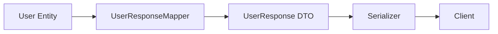
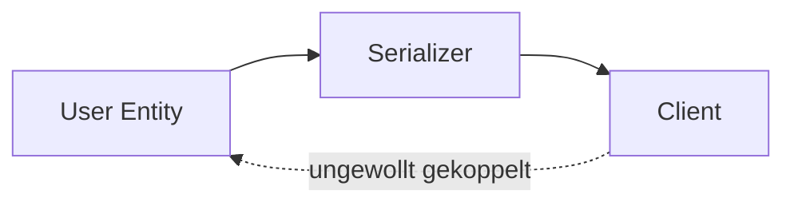
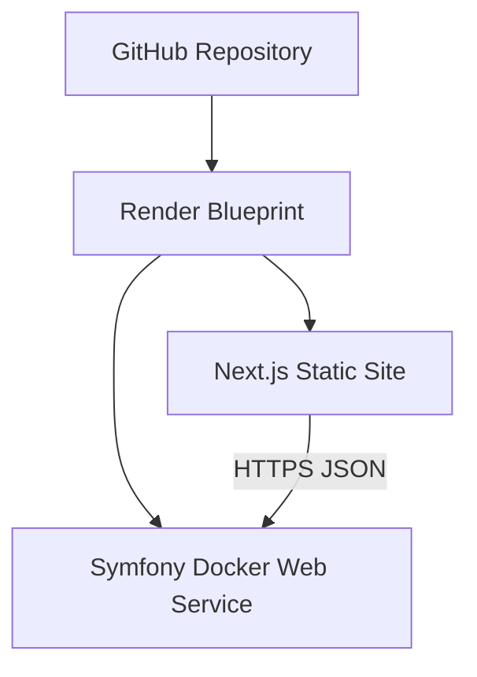

# DTO & Mapper Workshop – Specification

Status: Draft 0.1  
Workshop language: English  
Specification language: German  
Duration: 60 minutes plus 15 minutes buffer  
Group size: 2–6 participants

## 1. Product vision

Der Workshop ist ein geführtes, interaktives Browser-Lab für Junior-Entwickler*innen. Die Teilnehmenden benötigen nur einen aktuellen Browser. Sie installieren keine Programmiersprache, keine IDE, kein Framework und keine Container.

Die Website erklärt DTOs und Mapper an einem durchgängigen Beispiel und lässt jede Person vier aufeinander aufbauende Aufgaben selbst lösen. Beim Start kann zwischen PHP, TypeScript, Python und Java gewählt werden. Inhalt, Daten, Lernziele und erwartete Ergebnisse bleiben in allen Tracks identisch; nur Syntax, Starter-Code, Hinweise, Lösungen und Validierungsregeln unterscheiden sich.

Eine echte Symfony-Anwendung liefert die Vorher-/Nachher-API. Der Code im Browser ist eine sichere Lernsimulation und wird nicht auf dem Server ausgeführt.

## 2. Ziele und Nicht-Ziele

### 2.1 Lernziele

Nach dem Workshop können die Teilnehmenden:

1. erklären, welches Problem DTOs und Mapper lösen;
2. DTO, Entity und Mapper voneinander unterscheiden;
3. die Risiken einer direkt serialisierten Entity benennen;
4. ein typisiertes, möglichst unveränderliches DTO definieren;
5. einen expliziten Mapper für Umbenennung, Normalisierung und Typkonvertierung schreiben;
6. DTOs an Request-, Response- und externen Systemgrenzen einsetzen;
7. Vorteile und Kosten dieser zusätzlichen Abstraktion abwägen.

### 2.2 Nicht-Ziele

- Einführung in OOP oder grundlegende Programmierung
- Einführung in Symfony, Spring Boot, FastAPI oder ein Node.js-Framework
- Ausführung beliebigen Teilnehmenden-Codes
- Vollständige IDE oder Online-Compiler
- Datenbank, Anmeldung, Benutzerkonten oder persistente Serverdaten
- Wettbewerb, Rangliste oder Zeitdruck
- WireMock oder ein zusätzliches simuliertes Backend
- Behauptung, der hier gezeigte Objekt-Mapper sei Fowlers datenbankbezogenes Data-Mapper-Pattern

## 3. Zielgruppe

Die primäre Zielgruppe sind Junior-Entwickler*innen mit unterschiedlichen Programmiersprachenkenntnissen. Vorausgesetzt werden:

- OOP-Grundlagen;
- Klassen, Objekte, Methoden und Konstruktoren;
- grundlegendes Verständnis von Typen;
- grobes Verständnis von HTTP und JSON.

PHP- oder Symfony-Erfahrung wird nicht vorausgesetzt.

## 4. Fachliche Einordnung

### 4.1 DTO

Ein Data Transfer Object transportiert bewusst ausgewählte Daten über eine Grenze. Es enthält keine fachliche Geschäftslogik. Im Workshop werden DTOs möglichst unveränderlich und explizit typisiert gezeigt.

Typische Grenzen:

- HTTP-Request zur Anwendung;
- Anwendung zur HTTP-Response;
- externe API zur eigenen Anwendung;
- Schicht- oder Prozessgrenze.

### 4.2 Mapper

Ein Mapper übersetzt explizit zwischen zwei Datenmodellen. Er kann:

- Felder umbenennen, etwa `user_name` zu `userName`;
- Werte normalisieren, etwa trimmen oder kleinschreiben;
- Typen konvertieren, etwa Text zu Datum;
- mehrere Werte zusammenführen;
- interne oder vertrauliche Felder bewusst auslassen;
- fremde Begriffe in die Sprache der eigenen Anwendung übersetzen.

Der im Workshop verwendete `UserResponseMapper` ist ein Object Mapper beziehungsweise Assembler. Er wird ausdrücklich nicht mit dem Datenbankmuster Data Mapper gleichgesetzt.

### 4.3 Warum diese Muster entstanden sind

Wenn interne Objekte direkt über Systemgrenzen übertragen werden, wird der externe Vertrag ungewollt an das interne Modell gekoppelt. Historisch waren Transfer Objects besonders bei entfernten Aufrufen hilfreich: Statt vieler kleiner Aufrufe wurde ein gezieltes Datenpaket übertragen. In modernen Webanwendungen schützen DTOs vor allem API-Verträge und machen Transformationen sichtbar.

Mapper entstanden aus der Notwendigkeit, unterschiedliche Modelle nicht durch implizite, verstreute Konvertierungslogik miteinander zu verkleben.

### 4.4 Vorteile

- stabiler, bewusst definierter API-Vertrag;
- keine versehentliche Offenlegung interner oder sensibler Felder;
- klare Typen und frühere Fehlererkennung;
- kontrollierte Umbenennung und Formatierung;
- unabhängige Weiterentwicklung von Entity und API;
- Transformationen sind auffindbar und testbar;
- externe Anbieter bleiben hinter einer eigenen Grenze gekapselt.

### 4.5 Nachteile und Grenzen

- zusätzliche Klassen beziehungsweise Records;
- mehr Mapping-Code und Tests;
- mögliche Dopplung ähnlicher Feldlisten;
- Änderungen müssen an mehreren Stellen nachvollzogen werden;
- für sehr kleine, kurzlebige Anwendungen kann der Aufwand größer als der Nutzen sein;
- generische oder automatische Mapper können wichtige Transformationen verstecken.

Der Workshop vermittelt deshalb keine Regel „immer DTO“, sondern eine begründete Entscheidung an echten Systemgrenzen.

## 5. Durchgängige Geschichte

Alle Aufgaben gehören zur Geschichte „User Registration“.

Ein Client sendet Registrierungsdaten. Die Anwendung normalisiert diese Daten, verarbeitet das Ergebnis eines externen Identity-Service und liefert anschließend eine sichere öffentliche User-Response. Das interne `User`-Entity enthält mehr Informationen als der öffentliche Vertrag.

### 5.1 Internes User-Entity

Das reale Symfony-Beispiel verwendet deterministische Beispieldaten und keine Datenbank:

| Feld | Beispiel | Öffentlich? |
|---|---|---:|
| `id` | `7` | ja |
| `userName` | `ada.lovelace` | ja |
| `firstName` | `Ada` | indirekt |
| `lastName` | `Lovelace` | indirekt |
| `birthDate` | `1815-12-10` | formatiert |
| `email` | `ada@example.test` | ja |
| `passwordHash` | `$argon2id$…` | nein |
| `internalNote` | `VIP migration candidate` | nein |
| `createdAt` | festes Datum | nur bei Bedarf |

### 5.2 Problematischer Entity-Endpunkt

`GET /api/demo/users/7/entity`

Der Endpunkt serialisiert absichtlich das interne Entity und demonstriert:

- geleakte interne Felder;
- instabiles Datumsformat;
- enge Kopplung zwischen Entity und API;
- fehlende Kontrolle über die öffentliche Darstellung.

### 5.3 Sicherer DTO-Endpunkt

`GET /api/demo/users/7/dto`

Erwartete öffentliche Response:

```json
{
  "id": 7,
  "userName": "ada.lovelace",
  "displayName": "Ada Lovelace",
  "birthDate": "1815-12-10",
  "email": "ada@example.test"
}
```

Datenfluss:



Problematischer Datenfluss:



## 6. Die sechs Übungen der Registration Migration

Die Aufgaben sind sequenziell. Eine Aufgabe wird erst freigeschaltet, wenn die aktuelle Lösung alle Regeln erfüllt. Überspringen ist nicht möglich.

### 6.1 Aufgabe 1 – Typed Request DTO

Leitfrage: Wie definieren wir einen klaren und typisierten Eingabevertrag?

Die Teilnehmenden vervollständigen ein unveränderliches `CreateUserRequest` mit:

- `userName: string`;
- `firstName: string`;
- `lastName: string`;
- `birthDate: date`;
- `email: string`.

Der sichtbare Task Brief beschreibt den konkreten Einsatzfall: Eine Person erstellt in der
Anwendung ein Konto und das Registrierungsformular sendet fünf Informationen an die Anwendung.
Die Aufgabe lautet, in der track-spezifischen Datei `CreateUserRequest` ein unveränderliches DTO
für genau diese Eingabegrenze anzulegen. Der Brief nennt als Erfolgskriterium die fünf Felder mit
geeigneten Typen und Unveränderlichkeit und grenzt Validierung, Speichern und Transformation
ausdrücklich aus. Er ist vollständig auf Englisch und Deutsch lokalisiert; die leichte englische
Formulierung lautet: „No database drama yet — this step only defines the shape of the data.“

Sprachdarstellung:

| Track | Zielkonstrukt |
|---|---|
| PHP | `final readonly class` |
| TypeScript | Klasse oder Objektvertrag mit `readonly` |
| Python | `@dataclass(frozen=True)` |
| Java | `record` |

Validierung prüft Feldnamen, Typen und Unveränderlichkeit. Sie verlangt keine identische Textlösung.

Lernpunkt: Ein DTO macht die übertragenen Daten explizit und ist nicht das Domain-Entity.

### 6.2 Aufgabe 2 – Request Mapper

Leitfrage: Wo gehören Umbenennung, Normalisierung und Typkonvertierung hin?

Rohdaten:

```json
{
  "user_name": "  Ada.Lovelace ",
  "first_name": " Ada ",
  "last_name": " Lovelace ",
  "birth_date": "1815-12-10",
  "email": " ADA@EXAMPLE.TEST "
}
```

Der `CreateUserRequestMapper` erzeugt das DTO aus Aufgabe 1 und führt aus:

- `user_name` → `userName`;
- Leerzeichen entfernen;
- Benutzername und E-Mail kleinschreiben;
- `birth_date` vom Text in den jeweiligen Datumstyp konvertieren.

Der lokalisierte Task Brief verankert diese Schritte in der Registration: Ein älterer
Registrierungsbildschirm liefert `snake_case`-Schlüssel sowie möglicherweise Leerzeichen und
uneinheitliche Groß- und Kleinschreibung. Die Teilnehmenden lesen diese Werte als `form`, bereinigen
und übersetzen sie einmal an der Grenze in das `CreateUserRequest`; sie verändern weder das
ursprüngliche Formular noch ergänzen sie Validierungsregeln. Ein sichtbares Vorher-/Nachher-Beispiel
macht `user_name: "  Ada.Lovelace "` → `userName: "ada.lovelace"` konkret, ohne den Codeweg
vorzugeben.

Erwartetes fachliches Ergebnis:

```text
userName = ada.lovelace
firstName = Ada
lastName = Lovelace
birthDate = 1815-12-10 as date
email = ada@example.test
```

Lernpunkt: Der Mapper konzentriert Grenzlogik an einem sichtbaren, testbaren Ort.

### 6.3 Aufgabe 3 – WelcomeEmail DTO

Vor dem Mapper wird der Vertrag für die Benachrichtigungsgrenze definiert: `recipientEmail`, `recipientName`, `subject` und `body`. Das DTO ist unveränderlich. Es gibt keinen Mail-Provider und keine Nebenwirkung.

### 6.4 Aufgabe 4 – WelcomeEmail Mapper

Ein bereits erzeugter interner `User` wird in `WelcomeEmail` abgebildet: `email` wird `recipientEmail`, Vor- und Nachname ergeben `recipientName`, Betreff und Text begrüßen die Person. Die Website bereitet ausschließlich lokale Demonstrationsdaten vor.

### 6.5 Aufgabe 5 – RegistrationResponse DTO

Vor der öffentlichen Abbildung definieren Teilnehmende den unveränderlichen Vertrag `RegistrationResponse` mit `id`, `userName`, `displayName`, `birthDate` und `email`. Private Entity-Felder gehören nicht zu diesem Vertrag.

### 6.6 Aufgabe 6 – RegistrationResponse Mapper

Der Mapper erzeugt aus dem internen `User` die sichere öffentliche Response: Er übernimmt öffentliche Felder, verbindet Namen zu `displayName`, formatiert `birthDate` als `YYYY-MM-DD` und lässt `passwordHash` sowie `internalNote` aus. Das Ergebnis ist nur lokale, deterministische Lehr-Evidenz.

## 7. Lerninteraktion

### 7.1 Einstieg

1. Landingpage öffnen;
2. Workshopziel und Dauer sehen;
3. PHP, TypeScript, Python oder Java wählen;
4. ohne Anmeldung starten.

Die Sprache kann jederzeit im Header geändert werden. Ein Wechsel während einer unvollständigen Aufgabe erfordert eine Bestätigung und setzt nur den aktuellen Entwurf zurück. Bereits abgeschlossene Aufgaben bleiben abgeschlossen.

### 7.2 Aufgabenansicht

Jede Aufgabe enthält:

- kurze Problemsituation;
- Vorher-Daten beziehungsweise vorhandenen Code;
- erwartetes fachliches Ergebnis;
- CodeMirror-Editor mit vollständig sichtbarer Datei;
- klar markierten, allein editierbaren `TODO`-Bereich;
- Aktion `Check solution`;
- verständliches Testfeedback;
- progressive Hilfekarten;
- gesperrte Aktion `Continue`, bis die Aufgabe bestanden ist.

### 7.3 Hilfekarten

Hinweise erscheinen stufenweise:

1. Konzept-Hinweis ohne Syntax;
2. verfügbare Felder, Getter und Zieltypen;
3. sprachspezifischer Syntax-Hinweis;
4. `Insert solution` als Auffanglösung.

`Insert solution` trägt den Code ein, führt die Validierung aus und erklärt, warum die Lösung funktioniert. Es ist kein stilles Überspringen.

### 7.4 Feedback

Feedback beschreibt die verletzte fachliche Regel, zum Beispiel:

- `user_name` wurde noch nicht auf `userName` abgebildet;
- `birthDate` ist weiterhin Text statt eines Datumstyps;
- `displayName` enthält noch nicht Vor- und Nachnamen;
- `passwordHash` darf nicht in der Response vorkommen.

Die Meldung verrät nicht sofort die vollständige Lösung.

### 7.5 Abschluss

Nach Aufgabe 6 zeigt die Abschlussansicht die sichere `RegistrationResponse` und die vorbereitete `WelcomeEmail`; danach folgen:

- drei kurze Verständnisfragen;
- Möglichkeit, ein Abschlusszertifikat lokal im Browser zu erzeugen: es bescheinigt die vier
  gelösten Aufgaben und den bestandenen Wissenscheck, nicht die bloße Teilnahme. Das Dokument
  ist als Diplom eines fiktiven Instituts gestaltet, trägt keine Registriernummer und keinen
  prüfbaren Nachweis und heißt immer `Certificate-Workshop.pdf`;
- Möglichkeit, den Workshop lokal zurückzusetzen.

## 8. Zeitplan

| Zeit | Inhalt |
|---:|---|
| 0–5 min | Einstieg, Ziel und Sprachwahl |
| 5–12 min | Problemgeschichte, Herkunft und Begriffe |
| 12–17 min | Live-Vergleich: Entity-Response und gewünschter Vertrag |
| 17–23 min | Aufgabe 1: CreateUserRequest DTO |
| 23–30 min | Aufgabe 2: Legacy-Profile Mapper |
| 30–35 min | Aufgabe 3: WelcomeEmail DTO |
| 35–41 min | Aufgabe 4: WelcomeEmail Mapper |
| 41–46 min | Aufgabe 5: RegistrationResponse DTO |
| 46–52 min | Aufgabe 6: RegistrationResponse Mapper |
| 52–56 min | Vorteile, Nachteile und Einsatzentscheidung |
| 56–60 min | Wissenscheck und Zusammenfassung |
| +15 min | Unterstützung, Diskussion und spätere Abschlüsse |

Der Kern endet nach 60 Minuten. Der Puffer ist kein zusätzlicher Pflichtinhalt.

## 9. Validierungsmodell

### 9.1 Grundsatz

Teilnehmenden-Code wird weder im Browser evaluiert noch an Symfony gesendet oder auf dem Server ausgeführt. Dadurch benötigen wir keine Sandbox für PHP, Node.js, Python oder Java.

### 9.2 Technischer Ansatz

- CodeMirror 6 stellt Editor und Sprachunterstützung bereit.
- Lezer-basierte Syntaxbäume dienen als Grundlage der Prüfung.
- Pro Aufgabe und Sprache existiert ein kleiner deklarativer Validator.
- Insgesamt werden 16 Aufgabenkonfigurationen validiert: 4 Aufgaben × 4 Sprachen.
- Formatierung, Leerzeichen und semantisch gleichwertige Ausdrücke dürfen variieren.
- Die Validatoren prüfen nur Regeln, die zum jeweiligen Lernziel gehören.

### 9.3 Validator-Ergebnis

```ts
type ValidationResult = {
  passed: boolean;
  checks: Array<{
    id: string;
    passed: boolean;
    message: string;
  }>;
};
```

Validatoren liefern keine versteckten Musterlösungen zurück.

## 10. Fortschritt und Zustand

Es gibt keine Anmeldung und keinen Serverzustand.

Im Browser werden gespeichert:

- gewählte Programmiersprache;
- abgeschlossene Aufgaben;
- aktueller Aufgabenentwurf;
- verwendete Hinweise;
- Abschluss des Wissenschecks.

Speicher: `localStorage`, versioniert durch einen Schema-Key. Eine inkompatible neue Workshop-Version setzt nur den Workshopzustand zurück. `Reset workshop` erfordert eine Bestätigung.

Mehrere Teilnehmende arbeiten unabhängig auf ihren eigenen Geräten.

## 11. Visuelles und Motion-Konzept

Das konkrete Design wird später in `DESIGN.md` festgelegt. Die funktionale Leitidee lautet „Data Transit Lab“:

- Eine persistente 3D-Datenpipeline begleitet die vier Stationen.
- Das Datenobjekt verändert sichtbar Form, Namen und Typen.
- R3F und Drei erzeugen die Szene.
- Postprocessing wird sparsam für Licht und Tiefe eingesetzt.
- GSAP steuert DOM- und Aufgabenübergänge.
- Code und Lerninhalt bleiben visuell dominant.

Verbindliche Qualitätsregeln:

- `prefers-reduced-motion` wird respektiert;
- vollständiger 2D-Fallback ohne WebGL;
- adaptive Qualität für schwächere Geräte;
- keine Animation blockiert Editor oder Navigation;
- Tastaturbedienung und sichtbarer Fokus;
- ausreichende Kontraste und verständliche Statusmeldungen;
- dynamisches Laden schwerer Editor- und 3D-Module.

PBR-Materialien und HDRI-Dateien müssen lokal versioniert oder zuverlässig ausgeliefert und lizenzrechtlich dokumentiert werden.

## 12. Technische Architektur

### 12.1 Monorepo

```text
workshop-dto/
├── apps/
│   ├── web/                 # Next.js, TypeScript, R3F, CodeMirror
│   └── api/                 # Symfony demo API
├── docs/
│   ├── SPECIFICATION.md
│   └── DESIGN.md            # später
├── infrastructure/
│   └── render/              # optionale Deployment-Hilfen
├── docker-compose.yml       # lokale Entwicklung
├── render.yaml              # Render Blueprint
└── README.md
```

### 12.2 Web-Anwendung

- Next.js mit App Router und TypeScript;
- statischer Export, solange keine Serverfunktion benötigt wird;
- Client Components für Editor, Fortschritt, Sprachwechsel und 3D;
- Aufgabeninhalt als typisierte lokale Konfiguration;
- keine geheimen Werte im Frontend;
- browserseitige Requests ausschließlich an die Demo-API.

### 12.3 Symfony-API

- echte Symfony-Anwendung;
- deterministischer `UserSampleProvider` statt Datenbank;
- absichtlich problematischer Entity-Endpunkt;
- sicherer DTO-Endpunkt mit echtem `UserResponseMapper`;
- JSON-Responses und Health-Endpunkt;
- CORS nur für die konfigurierte Workshop-Frontend-Origin;
- keine Ausführung oder Speicherung von Editor-Inhalten.

### 12.4 Render-Deployment



Render-Ziel:

- Next.js als Static Site;
- Symfony als Docker Web Service;
- beide Anwendungen aus demselben Monorepo;
- Konfiguration über `render.yaml`;
- automatische Deployments von `main`;
- öffentliche Workshop-URL;
- Health-Check und verständlicher Cold-Start-Zustand;
- lokales Docker Compose bleibt provider-neutral.

Vor einem Workshop wird die API durch einen Preflight geöffnet. Die Oberfläche darf bei einem Free-Tier-Cold-Start nicht hängen, sondern zeigt einen klaren Vorbereitungszustand und versucht kontrolliert erneut.

## 13. Inhaltliche Konsistenz der vier Sprachtracks

Eine zentrale sprachneutrale Aufgabendefinition enthält:

- Lernziel;
- Eingabedaten;
- erwartetes Ergebnis;
- fachliche Checks;
- Erklärtext.

Sprachadapter ergänzen:

- Dateiname und Syntax;
- Starter-Code;
- editierbare Bereiche;
- Hinweise;
- Musterlösung;
- AST- beziehungsweise Syntaxregeln.

Ein neuer Track darf fachliche Regeln nicht neu definieren. Dadurch bleibt der Workshop in allen Sprachen gleichwertig.

## 14. Moderationskonzept für zwei Personen

### Person A – Facilitation

- führt durch Geschichte und Begriffe;
- startet Live-Demos;
- hält Zeit und gemeinsame Übergänge;
- moderiert Abschluss und Diskussion.

### Person B – Participant Support

- beobachtet Fortschritt und technische Probleme;
- unterstützt einzelne Personen ohne Lösung vorzugeben;
- sammelt wiederkehrende Fragen;
- übernimmt bei Bedarf die Erklärung einer Mapping-Variante.

Bei zwei Teilnehmenden können beide gemeinsam moderieren. Bei sechs Teilnehmenden bleibt Person A vorne und Person B unterstützt im Raum.

## 15. Materialien im Repository

Vor der Abgabe müssen enthalten sein:

- Bewertungsbogen;
- Workshop-Spezifikation;
- Design-Spezifikation;
- Moderationsskript und Zeitplan;
- Architektur- und Datenflussdiagramme;
- Quellcode für Website und Symfony-API;
- Aufgaben für alle vier Sprachtracks;
- Validierungsregeln;
- Musterlösungen;
- lokale Startanleitung;
- Render-Deployment-Konfiguration;
- Lizenzhinweise für verwendete Assets;
- Test- und Workshop-Checkliste.

## 16. Abnahmekriterien

Der Workshop gilt als inhaltlich und technisch bereit, wenn:

1. eine Person ohne Anmeldung und Installation starten kann;
2. alle vier Sprachtracks dieselben fachlichen Ergebnisse für alle sechs Schritte erzeugen;
3. keine Aufgabe übersprungen werden kann;
4. alle 24 Aufgaben-/Sprachkombinationen gültige und typische ungültige Lösungen erkennen;
5. `Insert solution` jede Aufgabe korrekt abschließt und erklärt;
6. Sprachwechsel und Reload keinen abgeschlossenen Fortschritt verlieren;
7. die echte Symfony-API den Entity-Leak und die sichere DTO-Response zeigt;
8. kein Editor-Code ausgeführt oder an den Server übertragen wird;
9. zwei bis sechs Personen parallel und unabhängig arbeiten können;
10. der Kernablauf in einem Probelauf höchstens 60 Minuten dauert;
11. Reduced Motion und der 2D-Fallback den vollständigen Workshop ermöglichen;
12. Render-Deployment und lokales Docker Compose reproduzierbar funktionieren;
13. alle bewertungsrelevanten Materialien im Repository liegen.

## 17. Bezug zum Bewertungsraster

| Bewertungsbereich | Nachweis im Projekt |
|---|---|
| Materialien im Repository | Abschnitt 15 und vollständiges Monorepo |
| Einordnung und Anwendungsfälle | Abschnitte 4–6 |
| Nutzen, Vor- und Nachteile | Abschnitte 4.4 und 4.5 |
| erklärende Diagramme | Abschnitte 5 und 12 sowie spätere Website-Visualisierung |
| Beispielanwendung | echte Symfony-Vorher-/Nachher-API |
| Struktur und roter Faden | User-Registration-Geschichte und Abschnitt 8 |
| UML/Architektur | Datenfluss- und Deploymentdiagramme |
| Dauer 60–90 Minuten | 60 Minuten plus 15 Minuten Puffer |
| interaktive Übung | vier sequenzielle Browser-Aufgaben |
| bereitgestellte Umgebung | gehostete Website ohne Installation |
| Musterlösungen und Hilfe | progressive Hilfen und `Insert solution` |
| Unterstützung für 2–6 Personen | unabhängiger Browserzustand und Moderationskonzept |
| Zielgruppenorientierung | Junior-Level, OOP vorausgesetzt, freie Sprachwahl |

## 18. Noch offene Entscheidungen

Diese Punkte werden bewusst erst nach Freigabe der Produktspezifikation entschieden:

- konkrete visuelle Sprache, Farben und Typografie in `DESIGN.md`;
- exakte englische Texte und Moderationsformulierungen für die Aufgaben 2–4;
- konkrete Symfony- und PHP-Version beim Repository-Setup;
- genaue CodeMirror-/Lezer-Regeln pro Aufgabe und Sprache;
- endgültige Render-Domain beziehungsweise eigene Domain;
- Asset-Auswahl für PBR und HDRI;
- Browser- und Geräte-Testmatrix.
